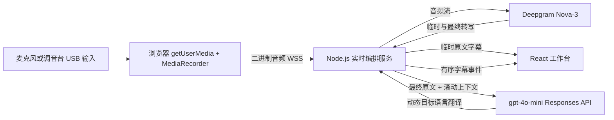
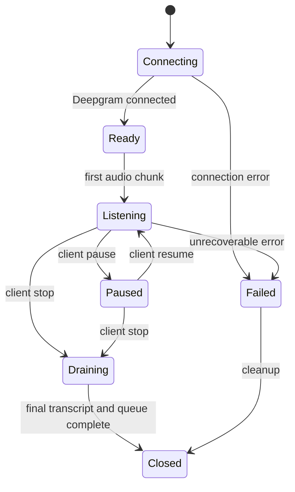

# Church Translation

面向澳洲教会讲道场景的实时字幕与翻译工具。操作者选择麦克风、讲话语言和 1 至 3 个目标语言栏，系统将英语、粤语、普通话、日语、韩语或印度尼西亚语实时转写并翻译。

> 当前状态：MVP 前后端、共享协议与 Docker 部署已经实现。填入供应商密钥后即可本地运行。本文中的价格核对日期为 2026-08-30，正式上线前应重新查看供应商价格与数据政策。

维护者应同时阅读 [本轮实现记录](doc/session-2026-08-30.md)；生产上线步骤见 [部署文档](deployment.md)。

## 1. 目标与假设

### 目标

- 所有操作者必须登录；管理员可在主页右上角新增或删除普通账户。
- 一个按钮开始或停止收音，并明确显示麦克风、网络、转写和翻译状态。
- 从浏览器选择当前电脑可识别的麦克风或 USB 音频输入设备。
- Deepgram 只负责实时语音转文字。
- `gpt-4o-mini` 只负责结合最近上下文，将已确认的原文翻译为用户选择的英语、简体中文、繁体中文、日语、韩语或印度尼西亚语。
- 每周约使用 10 小时，优先保证低成本、低延迟和长时间稳定运行。

### 第一版假设

- 默认讲话语言是澳洲英语 `en-AU`，也可选择粤语 `zh-HK`、普通话 `zh-CN`、日语 `ja`、韩语 `ko-KR`、印度尼西亚语 `id`，以及美式/英式英语。
- 输出是文字，不包含机器朗读。
- 单个服务实例默认允许最多 10 个独立操作者/讲道会话，可通过 `MAX_ACTIVE_SESSIONS` 在 1 至 100 之间调整。
- 第一版支持最新版 Chrome 和 Edge。Safari 的音频容器差异放到第二阶段处理。
- 不保存原始音频或目标语言翻译；每个任务的稳定 source 转写自动保存为服务器根目录 `log/` 下的 UTF-8 文本文件。

如果讲员会频繁混合英语和其他语言，需要改用 Deepgram 多语言模型并重新测试准确率与成本。

## 2. MVP 范围

### 包含

- 麦克风授权、设备选择和输入音量指示。
- Windows 系统声音采集，可翻译浏览器、播放器或会议软件正在播放的受支持语言音频。
- 开始、暂停、继续和停止。
- 无语音自动停止，默认 15 分钟，操作者可在开始前设置 2 至 30 分钟。
- 当前讲话语言的临时字幕，以及稳定后的 1 至 3 种目标语言段落。
- 自动滚动、暂停自动滚动、清空页面、全屏投影和本地下载文本。
- 长静音保活、错误提示、翻译排队、顺序保证和会话结束清理。
- 服务端密钥保护、Origin 校验、速率限制和可配置并发会话上限。
- SQLite 账户存储、scrypt 密码哈希、HttpOnly 会话 Cookie 和管理员账户管理。

### 暂不包含

- 可搜索的讲道历史、字幕数据库和云端录音。source 仅按任务保存为普通文本，账户与登录会话单独保存在 SQLite 中。
- 跨多个后端实例的全局并发配额、共享会话恢复和观众分享链接。
- 语音合成、字幕视频叠加、人工协同编辑。
- 自动查找或逐字引用圣经经文。模型只能翻译讲员实际说出的内容。

## 3. 用户界面

页面直接进入工作台，不制作营销首页。

1. 顶栏显示产品名、连接状态、已运行时间和全屏按钮。
2. 控制区包含音频设备下拉框、来源语言、输入音量和一个醒目的开始/停止按钮。
3. 当前讲话语言的临时字幕位于翻译区下方，使用较小字号和较低视觉权重。
4. 桌面端并排显示 1 至 3 个翻译栏；每栏可独立选择目标语言、调整字号或用 `×` 删除，工具栏用 `+` 新增。移动端使用与当前栏同步的语言标签页。
5. 每个已确认段落保持所选目标语言的相同顺序，不让后返回的请求插到前面。
6. 出错时保留已经完成的字幕，并显示可执行的恢复操作。
7. 最新版 Edge/Chrome 可打开 Document Picture-in-Picture 动态悬浮字幕窗，在 Windows 上保持置顶。
8. 每个翻译栏和实时 source 分别提供 `A-` / `A+` 字号控制，互不影响；字幕段落采用紧凑单行间距。
9. 控制区显示 `Auto-stop · no speech` 滑杆，默认 15 分钟、范围 2 至 30 分钟；活动会话期间锁定，避免误改当前会话策略。

网页无法把自定义翻译文本直接注入 Windows 自带的 Live Captions，因为 Windows 没有向网页开放该接口。若需要透明、可拖动、开机启动的系统级字幕层，应另行封装 Tauri/Electron 桌面客户端；当前画中画字幕窗是不需要安装客户端的网页方案。

`Floating` 是独立热按钮，也可按 `Alt+F` 打开或关闭。悬浮窗只显示实时 source 和当前 1 至 3 个目标语言结果，不再额外显示一行 matched source；所有行使用相同字体和字号，并在窗口内提供独立 `A-` / `A+`。关闭时会先卸载悬浮窗自己的 React root，再关闭画中画文档；主页面字幕状态、麦克风、MediaRecorder 和 WebSocket 始终独立，不会被 Floating 打开或关闭。音量表限制为约 12 FPS。

视觉上采用高对比度白色、炭黑文字、酒红和柔和金色点缀，保持庄重、安静和适合投影。基督教主题只使用克制的十字或经文排版细节，不牺牲可读性。正文需要支持大字号、键盘操作和屏幕阅读器。

## 4. 总体架构



### 推荐技术栈

| 层 | 选择 | 原因 |
| --- | --- | --- |
| 前端 | React + TypeScript + Vite | 轻量、浏览器音频 API 支持直接、易部署 |
| 后端 | Node.js 22 + TypeScript + Fastify | 与前端共享类型，适合 WebSocket 与流式 I/O |
| 实时通信 | 单条 WebSocket 连接 | 同时发送二进制音频和接收状态/字幕，开销低 |
| 听写 | Deepgram `nova-3` | 实时转写、临时结果、终点检测和关键词增强 |
| 翻译 | OpenAI Responses API + `gpt-4o-mini-2024-07-18` | 固定版本、成本低、支持 Structured Outputs |
| 校验 | Zod | 统一校验环境变量和 WebSocket 消息 |
| 日志 | Pino | 结构化日志，并可屏蔽密钥和字幕正文 |
| 部署 | 单个 Docker 容器，悉尼区域 | 前后端同源，减少延迟和部署复杂度 |

`gpt-4o-mini` 不支持 OpenAI Realtime API。因此本方案不会把音频发给 OpenAI，而是在 Deepgram 确认一个语段后调用 Responses API。这也符合“Deepgram 负责听，4o-mini 负责理解和翻译”的职责边界。

## 5. 实时处理流程

### 5.1 获取音频

浏览器通过 `navigator.mediaDevices.getUserMedia()` 请求权限，并在授权后通过 `enumerateDevices()` 显示音频输入设备。

第一版使用：

```text
MIME: audio/webm;codecs=opus
MediaRecorder timeslice: 250 ms
Channel: mono preferred
Browser: latest Chrome or Edge
```

启动前必须用 `MediaRecorder.isTypeSupported()` 检查格式。浏览器把每个 `Blob` 转成 `ArrayBuffer`，通过同一条 WebSocket 以二进制帧发送。

这是带容器头的音频流，所以 Deepgram 请求中不要手动设置 `encoding` 和 `sample_rate`。Deepgram 会从容器头读取格式。第二阶段如需稳定支持 Safari，再增加 `AudioWorklet -> PCM16 16 kHz mono` 路径，并显式设置 `encoding=linear16&sample_rate=16000`。

生产环境必须使用 HTTPS/WSS；浏览器只允许 `localhost` 或安全上下文访问麦克风。

### 5.2 连接 Deepgram

后端收到 `session.start` 后先建立 Deepgram WebSocket，成功后才返回 `session.ready`，避免录下的开头无处发送。

初始参数：

```yaml
model: nova-3
language: 用户选择的固定语言代码
smart_format: true
punctuate: true
interim_results: true
endpointing: 300
vad_events: true
mip_opt_out: true
```

- `is_final=false`：只作为可变化的原文临时字幕，不发给 OpenAI。
- `is_final=true`：追加到当前稳定语段缓冲区。
- `speech_final=true`：说明检测到自然停顿，可以提交完整语段翻译。
- 不能只保存最后一次 `speech_final=true` 的文本；一个长句可能先产生多个 `is_final=true` 片段，必须先拼接。
- 如果超过 3 秒没有向 Deepgram 发送音频，后端每 3 至 5 秒发送文本帧 `{"type":"KeepAlive"}`，避免 10 秒无数据超时。

`endpointing=300` 是当前值。现场测试时可在 300 至 800 毫秒之间调整：太短会把讲员思考停顿切碎，太长会增加翻译延迟。

Nova-3 官方支持本项目使用的 `en-AU`、`en-US`、`en-GB`、`zh-HK`、`zh-CN`、`ja`、`ko-KR` 和 `id`。每场会话传入一个固定 `language`；`language=multi` 当前不覆盖中文、粤语、韩语或印度尼西亚语，因此本项目不使用它代替用户选择。

### 5.3 切分翻译段落

只依赖停顿可能得到过长或过短的段落，因此使用以下任一条件触发翻译：

- Deepgram 返回 `speech_final=true`。
- 已确认文本以句号、问号或感叹号结束。
- 当前段落持续 7 秒以上。
- 当前段落超过约 120 个字符。

每个段落获得单调递增的 `sequence` 和唯一 `segmentId`。每个会话只有一个串行翻译队列，保证输出顺序。OpenAI 变慢时，后端可以合并尚未提交的相邻短段，不能丢弃已经确认的原文。

### 5.4 上下文翻译

每次请求发送：

- 当前待翻译原文段落。
- 最近 6 至 8 个已确认原文段落，最多约 1,200 字符。
- 教会维护的术语表，例如 `grace`、`covenant`、`Holy Spirit`、教会名和常见讲员姓名。
- 明确指令：上下文只用于消歧，只翻译当前段落，不补充讲员没有说过的神学观点或经文。

一次 OpenAI 请求同时生成当前栏所需的 1 至 3 种语言，避免多次调用导致术语和段落边界不一致。使用 `store: false` 和按目标列表动态生成的严格 JSON Schema，例如：

```json
{
	"en": "English translation",
	"zh-Hant": "繁體中文翻譯",
	"ja": "日本語訳"
}
```

建议的翻译规则：

```text
你是教会讲道的实时口译员。
忠实翻译 CURRENT，只用 CONTEXT 判断代词、术语和省略内容。
不要总结、解释、审查或添加教义；保留人名、数字和经文编号。
按照 TARGET_LANGUAGES 逐项翻译；简体和繁体中文必须使用对应字形。
固定使用 GLOSSARY 中提供的译法。原文不完整时保守翻译，不猜测缺失内容。
只返回指定 JSON Schema。
```

不建议让模型长期携带完整讲道历史。固定长度的滚动上下文更可控，也能避免输入 token 随讲道时长不断增长。

### 5.5 停止会话

停止顺序必须固定：

1. 停止 `MediaRecorder` 并发送最后一个音频块。
2. 对所有 `MediaStreamTrack` 调用 `stop()`，立即释放麦克风。
3. 后端向 Deepgram 发送 `Finalize`，接收最后的最终文本。
4. 等待翻译队列排空，或到达可配置的结束超时。
5. 向 Deepgram 发送 `CloseStream`，清理计时器和内存。
6. 返回 `session.closed`，前端允许下载本次文本。

## 6. WebSocket 协议

连接地址：`wss://<host>/ws/session`

客户端先发送控制消息，之后发送二进制音频：

```json
{
	"type": "session.start",
	"sourceLanguage": "en-AU",
	"targetLanguages": ["en", "zh-Hans", "id"],
	"mimeType": "audio/webm;codecs=opus",
	"inactivityTimeoutMinutes": 15
}
```

```json
{
	"type": "session.stop"
}
```

服务端事件至少包含：

| 事件 | 用途 |
| --- | --- |
| `session.ready` | Deepgram 已连接，可以开始发送音频 |
| `session.status` | `listening`、`paused`、`translating`、`reconnecting` |
| `transcript.interim` | 可变化的原文临时字幕 |
| `transcript.final` | 已确认的原文段落 |
| `translation.final` | 同一个段落的动态 `translations` 目标语言映射 |
| `session.closed` | 所有尾部结果处理完成 |
| `error` | 稳定错误码、用户可读说明及 `recoverable` 标记 |

最终翻译事件示例：

```json
{
	"type": "translation.final",
	"segmentId": "seg_01K...",
	"sequence": 12,
	"source": "Grace is not something we can earn.",
	"translations": {
		"en": "Grace is not something we can earn.",
		"zh-Hans": "恩典不是我们能够赚取的。",
		"id": "Kasih karunia bukanlah sesuatu yang dapat kita peroleh dengan usaha."
	},
	"startMs": 84120,
	"endMs": 88740
}
```

前后端共享消息 Schema。未知消息、过大消息或顺序错误的控制消息应立即拒绝，不能直接传给第三方 API。

## 7. 后端会话状态



会话对象只保存在内存中，拥有自己的 Deepgram 连接、最终文本缓冲区、OpenAI 队列、上下文窗口、保活计时器和 `AbortController`。任意一端断开都必须执行同一个幂等清理函数。

## 8. 建议目录结构

```text
churchTranslation/
├── apps/
│   ├── web/
│   │   └── src/
│   │       ├── audio/
│   │       ├── components/
│   │       ├── hooks/
│   │       └── state/
│   └── server/
│       └── src/
│           ├── deepgram/
│           ├── openai/
│           ├── sessions/
│           └── websocket/
├── packages/
│   └── contracts/
├── .env.example
├── docker-compose.yml
├── Dockerfile
└── package.json
```

账户和登录会话使用本机 SQLite。每个任务的稳定 source 原文写入 `log/YYYY-MM-DD_HH-mm-ss.txt`，目标语言翻译不落盘；同一秒开始多个任务时后续文件使用 `-2`、`-3` 后缀，避免覆盖。单个实例内，每条 WebSocket 都拥有独立 Deepgram 连接、OpenAI 翻译器、上下文、计时器和串行队列。若以后运行多个后端实例，账户库需要迁移到共享数据库，现有连接由负载均衡器保持在建立连接的实例；精确的跨实例全局上限或断线会话恢复需要 Redis/统一准入层。

## 9. 环境变量

```dotenv
DEEPGRAM_API_KEY=
OPENAI_API_KEY=

DEEPGRAM_MODEL=nova-3
OPENAI_MODEL=gpt-4o-mini-2024-07-18

ALLOWED_ORIGINS=https://translation.example.org
MAX_ACTIVE_SESSIONS=10
MAX_SESSION_MINUTES=180
PORT=3000
AUTH_DB_PATH=data/auth.sqlite
AUTH_COOKIE_SECURE=true
LOG_LEVEL=info
```

两把 API Key 只能存在于服务端环境变量或托管平台的 Secret Manager 中，绝不能出现在浏览器包、网页源码、日志或 WebSocket 消息中。

## 10. 音源建议

浏览器只能选择操作系统暴露为“输入设备”的音源。现场效果从优到劣通常是：

1. 教会调音台的 AUX/REC 输出接 USB 音频接口，再在网页中选择该 USB 输入。
2. 讲员的无线麦克风接收器或混音输出接 USB 音频接口。
3. 笔记本内置麦克风直接收现场扩声音箱。

前两种方式明显减少回声、混响和会众噪音。若使用调音台直出，应允许关闭浏览器的回声消除、降噪和自动增益；若使用笔记本麦克风，则默认开启这些处理。

“电脑正在播放的系统声音”不会自动出现在 `getUserMedia()` 中。当前版本通过 `getDisplayMedia()` 获取屏幕共享音轨；用户必须选择整个屏幕并勾选共享系统音频。

## 11. 可靠性与错误处理

| 场景 | 处理方式 |
| --- | --- |
| 用户拒绝麦克风 | 不创建后端会话，显示如何重新授权 |
| 没有可用设备 | 显示设备检查，并监听 `devicechange` |
| 浏览器不支持 WebM Opus | 提示使用 Chrome/Edge；第二阶段走 PCM fallback |
| Deepgram 长静音 | 3 至 5 秒文本 KeepAlive；停止时 Finalize + CloseStream |
| Deepgram 断线 | 明确显示中断；第一版要求操作者重新开始，不能假装丢失音频已恢复 |
| OpenAI 暂时失败 | 保留原文，指数退避重试最多 2 次，按 sequence 补回翻译 |
| OpenAI 队列积压 | 显示延迟状态并合并待提交短段，不丢最终原文 |
| 结构化输出无效 | Schema 校验失败后重试 1 次，仍失败则返回稳定错误码 |
| 页面刷新或关闭 | best-effort 发送停止，服务端断线清理兜底 |
| 会话超过上限 | 自动完成尾部处理并关闭，防止忘记停止产生费用 |
| 长时间没有语音 | 从最后一次非空 Deepgram 转写开始计时，达到用户设置的 2 至 30 分钟后由服务端自动停止；静音音频块不会续期 |

第二阶段可以在浏览器保存最近 5 至 10 秒的内存环形音频缓冲区，在短暂断线重连后补发。第一版不实现补发，避免时间戳、重复转写和容器头处理变复杂。

## 12. 安全与隐私

- 前端不接触 Deepgram 或 OpenAI 密钥，所有第三方连接由后端发起。
- HTTP API 和翻译 WebSocket 都要求登录。登录会话有效期为 12 小时，Cookie 使用 `HttpOnly` 和 `SameSite=Strict`；HTTPS 部署必须设置 `AUTH_COOKIE_SECURE=true`。
- 默认种子管理员为 `FOCUS-Jayd` / `FOCUS-Jayd`，每次空数据库启动时自动创建且不能在界面删除。由于该凭据固定，公网部署仍必须使用 HTTPS，并建议叠加网络 allowlist 或 VPN。
- 密码使用随机盐和 scrypt 哈希后写入 SQLite；会话 token 只保存 SHA-256 哈希。失败登录只返回和显示通用 `Error`，日志不记录用户名或密码。
- 校验 WebSocket `Origin`，限制消息大小、连接频率、总会话时长和活动会话数。
- 日志只记录会话 ID、延迟、错误码、token 和音频分钟数，不记录音频或字幕正文。
- OpenAI 请求设置 `store: false`；Deepgram 请求设置 `mip_opt_out: true`。上线前仍需确认账户级数据控制和供应商最新保留政策。
- 不把音频、interim 临时文本或目标语言翻译写入磁盘。稳定 source 段落按接收顺序逐行写入 `log/*.txt`；文件名使用服务器本地年月日时分秒。下载操作仍只在浏览器本地生成文件。
- `log/*.txt` 包含讲道原文，必须限制服务器文件权限并纳入隐私、保留期限和安全删除流程；应用不会自动上传这些文件。
- 聚会前取得讲员和教会同意，并告知现场声音会发送给第三方服务处理。涉及会众分享、祷告或辅导内容时，应另外确认所在地法律和教会隐私流程。
- 给 Deepgram 和 OpenAI 账户设置月度消费提醒及可用的预算上限。

登录不能替代网络和费用控制。继续保留同源限制、每 IP 登录/握手速率限制、并发会话上限和供应商预算上限；固定种子凭据不应作为公网唯一防线。

## 13. 延迟目标

正常网络下，从讲员停顿到两种翻译出现的目标：

| 阶段 | 目标 |
| --- | ---: |
| 浏览器音频分片 | 0.25 秒 |
| Deepgram 终点检测 | 0.3 至 0.8 秒 |
| 后端排队与网络 | 小于 0.3 秒 |
| `gpt-4o-mini` 翻译 | 0.5 至 2.0 秒 |
| 总体 P95 | 小于 4 秒 |

临时原文字幕通常会更早出现。翻译准确性和上下文完整性比追求逐词翻译更重要，因此不会翻译随时可能变化的 interim 文本。

## 14. 使用成本估算

每月音频量约为：

```text
10 小时/周 × 52 周 ÷ 12 月 ≈ 43.3 小时/月 ≈ 2,600 分钟/月
```

### Deepgram

2026-08-30 官网显示 Nova-3 Monolingual Streaming 按量付费促销价为 `$0.0048/分钟`，常规价为 `$0.0077/分钟`：

```text
促销价：2,600 × $0.0048 ≈ $12.48/月
常规价：2,600 × $0.0077 ≈ $20.02/月
```

可选 Keyterm Prompting 当前为 `$0.0013/分钟`，全部启用约增加 `$3.38/月`。应先用真实讲道做基线测试，再决定是否为神学术语启用。

### OpenAI

`gpt-4o-mini` 标准文本价格当前为输入 `$0.15/百万 token`、缓存输入 `$0.075/百万 token`、输出 `$0.60/百万 token`：

```text
月成本 = 输入 token ÷ 1,000,000 × $0.15
			 + 输出 token ÷ 1,000,000 × $0.60
```

按英语约 130 词/分钟、双语输出和有限滚动上下文估算，第一版可先预留 `$1 至 $3/月`，上线后必须依据 Responses API 的实际 `usage` 字段校准。

### 总预算

- Deepgram：约 `$12.48 至 $23.40/月`，取决于促销价和关键词增强。
- OpenAI：先预留 `$1 至 $3/月`。
- 单个小型悉尼区域容器：通常预留 `$5 至 $20/月`，以部署平台为准。
- 建议整体预算：约 `$20 至 $45 美元/月`，不包含税费，价格变化时重新计算。

## 15. 部署方案

第一版将 Vite 构建产物和 Fastify 服务放入同一个 Docker 容器，由同一域名提供 HTTPS 页面和 WSS 接口。

完整上线、HTTPS/WSS、升级与回滚命令见 [deployment.md](deployment.md)。

- 选择悉尼或澳洲东部区域，减少浏览器到后端的延迟。
- 反向代理必须支持 WebSocket，并把空闲超时设置为大于最长讲道时长。
- 提供 `/health/live` 和 `/health/ready`，但健康检查不得调用付费 API。
- 使用平台 Secret Manager 注入密钥。
- 单实例默认允许 10 个活动会话；上线前应按预期同时使用人数做负载测试，并确认 Deepgram/OpenAI 账户并发与速率配额。
- 发布前用真实域名和 HTTPS 测试麦克风权限，不能只在 `localhost` 验证。

## 16. 测试与验收

### 自动测试

- 单元测试：`is_final` 拼接、`speech_final` 触发、长度兜底、队列顺序、停止清理和 Schema 校验。
- 集成测试：模拟 Deepgram/OpenAI，验证二进制转发、重试和错误映射。
- 端到端测试：Chromium 虚拟麦克风播放固定英语音频，验证三种语言按序出现。
- 长时测试：至少持续 2 小时，包含 15 秒静音、暂停/继续和网络中断。

测试音频应获得许可或由团队自行录制，不把受版权保护的讲道录音提交到仓库。

### MVP 验收标准

- 点击开始后能选择并采集目标音频设备，停止后操作系统立即释放麦克风。
- 连续运行 60 分钟无内存持续增长、重复段落、乱序或静音断线。
- 原文临时字幕可更新，但已经显示的最终目标语言段落保持稳定。
- 正常网络下，停顿后的双语翻译 P95 小于 4 秒。
- OpenAI 故障时原文转写仍继续，恢复后按原顺序补齐翻译。
- 浏览器网络面板、前端构建产物和日志中均不存在供应商 API Key。
- 服务端不产生音频或目标翻译文件，只产生每个任务一份 source 原文文本。
- 真实教堂声学环境中测试人名、教会名、圣经书卷和经文编号，并由中文及印尼语母语者抽查。

建议记录以下匿名指标：音频分钟数、最终段落数、Deepgram/OpenAI 延迟 P50/P95、翻译队列深度、错误率和 token 使用量。指标中不包含字幕正文。

## 17. 实施顺序

1. 初始化 npm workspace、共享消息 Schema、环境变量校验和基础工作台。
2. 完成麦克风设备选择、MediaRecorder 分片、WebSocket 状态机和音量指示。
3. 接入 Deepgram，先做稳定的 source interim/final 字幕和正确停止流程。
4. 实现最终语段聚合、串行翻译队列、滚动上下文、术语表和 Structured Outputs。
5. 补齐错误恢复、超时、限流、日志脱敏、消费指标和本地文本下载。
6. 完成自动测试、两小时稳定性测试、Docker 和悉尼区域 HTTPS 部署。
7. 在真实教堂进行试运行，根据实际停顿调 `endpointing`，再由中印尼语使用者校准术语表。

## 18. 后续能力

- 只读观众页面和二维码，让学生用自己的手机选择中文或印尼语。
- 讲员/主持人分离、说话人标记和多音轨支持。
- Safari PCM 音频路径和短时断线补发。
- 经授权的讲道历史、搜索和字幕导出。
- 人工术语纠正面板，以及按教会保存的术语表。
- OBS/投影字幕模式和 WebVTT/SRT 导出。

## 19. 本地运行

需要 Linux/macOS 环境中的 Node.js 22+。在 WSL 中不要混用 Windows 版 npm。

```bash
cp .env.example .env
# 编辑 .env，填写 DEEPGRAM_API_KEY 和 OPENAI_API_KEY
npm install
npm run dev
```

开发页面为 `http://localhost:5173`，Vite 会把 `/api`、`/ws` 和 `/health` 代理到端口 `3000` 的 Fastify 服务。首次登录使用 `FOCUS-Jayd` / `FOCUS-Jayd`，再从右上角账号面板创建普通用户。

### 采集 Windows 系统声音

1. 使用最新版 Microsoft Edge 或 Google Chrome 打开页面。
2. 将 `Audio input` 切换到 `System audio`，然后点击开始。
3. 在浏览器共享选择器中选择 `Entire screen`，并勾选 `Share system audio`。
4. 播放电脑上的英语音频；网页会采集共享音轨，不使用麦克风。

系统声音采集要求 `localhost` 或 HTTPS。浏览器不会静默获取系统音频，每次开始都必须由用户确认共享。Firefox、Safari、手机浏览器以及部分远程桌面环境可能不提供系统音轨；如果页面提示没有收到系统声音，请重新选择整个屏幕并确认音频复选框已开启。

生产模式会先构建 React，再由 Fastify 在同一个端口提供页面和 WebSocket：

```bash
npm run build
npm start
# 打开 http://localhost:3000
```

默认 `LOG_LEVEL=info` 不输出高频 API 和队列时序日志，第三方 API 错误仍会记录。诊断延迟时临时设置 `LOG_LEVEL=debug`，可观察这些 `event`：

- `api.deepgram.connect.*`：Deepgram WebSocket 建连耗时。
- `api.deepgram.audio.first_chunk`：浏览器首个音频块到达后端。
- `api.deepgram.result.first` / `api.deepgram.result.final`：首次和最终转写返回时间。
- `queue.translation.started`：翻译开始及 `queueWaitMs` 排队时间。
- `api.openai.responses.request` / `response`：OpenAI 请求、响应及 `durationMs`。
- `api.openai.responses.error`：HTTP 状态、重试次数和失败耗时。

调试日志包含 ISO 8601 `timestamp`、`sessionId` 和语段 `sequence`，不会打印 API Key 或讲道正文。需要保存分析时可运行：

```bash
LOG_LEVEL=debug npm start 2>&1 | tee timing.log
```

运行全部检查：

```bash
npm test
npm run typecheck
npm run build
```

Docker 部署：

```bash
cp .env.example .env
# 填写密钥，并把 ALLOWED_ORIGINS 改为实际 HTTPS 域名
docker compose up --build -d
```

浏览器麦克风在远程环境中要求 HTTPS；生产反向代理也必须允许 WebSocket 长连接。完整配置见 [deployment.md](deployment.md)。

## 20. 官方资料

- [Deepgram Live Streaming](https://developers.deepgram.com/docs/getting-started-with-live-streaming-audio)
- [Deepgram 音频格式判断](https://developers.deepgram.com/docs/determining-your-audio-format-for-live-streaming-audio)
- [Deepgram Endpointing 与 Interim Results](https://developers.deepgram.com/docs/understand-endpointing-interim-results)
- [Deepgram KeepAlive](https://developers.deepgram.com/docs/audio-keep-alive)
- [Deepgram Pricing](https://deepgram.com/pricing)
- [OpenAI gpt-4o-mini](https://developers.openai.com/api/docs/models/gpt-4o-mini)
- [OpenAI Responses API](https://developers.openai.com/api/reference/resources/responses)
- [OpenAI Pricing](https://developers.openai.com/api/docs/pricing)
- [MDN getUserMedia](https://developer.mozilla.org/en-US/docs/Web/API/MediaDevices/getUserMedia)
- [MDN MediaRecorder](https://developer.mozilla.org/en-US/docs/Web/API/MediaRecorder)


