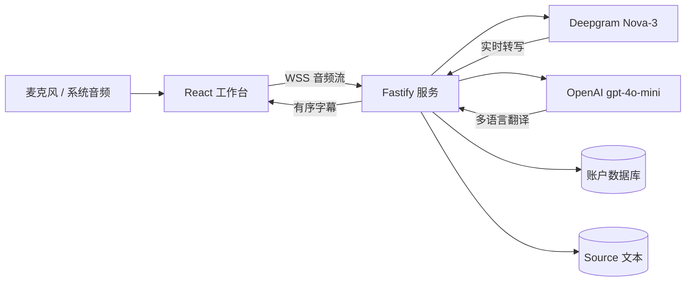

# Church Translation

面向教会讲道的实时字幕与多语言翻译系统。浏览器采集麦克风或 Windows 系统音频，由 Deepgram 转写、OpenAI 翻译，并同步显示在多个字幕栏中。


## 主要功能

- 支持英语、粤语、普通话、日语、韩语和印度尼西亚语语音输入。
- 同时显示 1 至 3 种目标语言，并保持字幕顺序一致。
- 支持麦克风、USB 音频设备和 Windows 系统声音。
- 提供全屏投影、悬浮字幕、字号调整、自动停止和文本下载。
- 用户登录、管理员账户管理及最多 10 个独立并发会话。

## 系统架构



## 部署

```bash
cp .env.example .env
# 填写 DEEPGRAM_API_KEY、OPENAI_API_KEY 和 ALLOWED_ORIGINS
docker compose up --build -d
```

生产环境必须通过 HTTPS/WSS 访问，否则浏览器无法使用麦克风或系统音频。

[完整部署说明](deployment.md) · [开发文档](developer.md)
